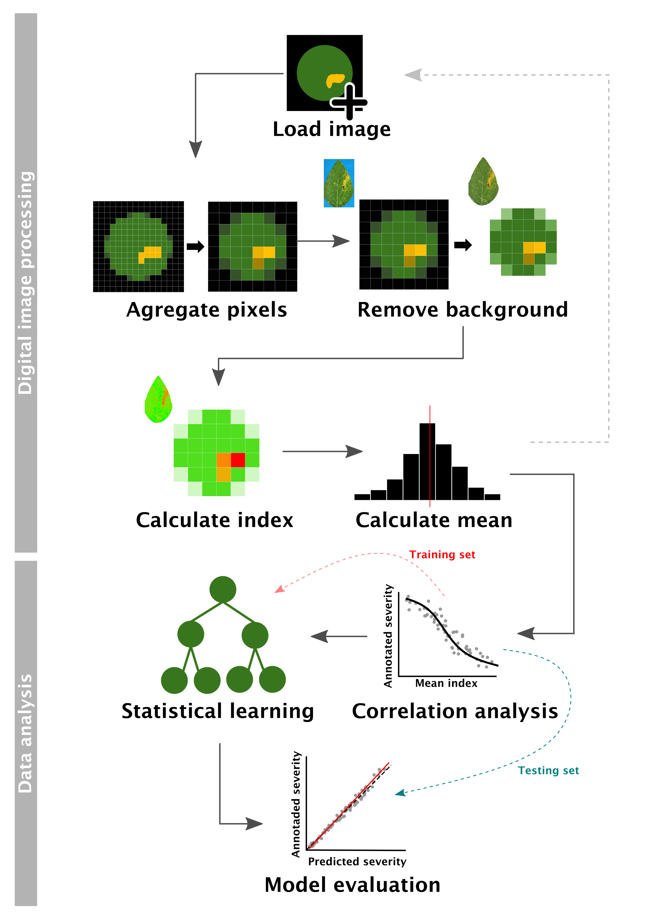

% About

 In this website are available the codes used to reproduce the analysis and results of the research conducted by a D.sc student Kaique dos S. Alves under the supervision of Prof. Emerson Del Ponte, Universidade Federal de Vicosa, MG, Brazil.

 We studied the relatioship between RGB-based spectral indices and leaf severity of five diseases and developed an automated approach for processing the leaf-images for predicting severity using boosting regression tree models.  
  
   

## Citation

Alves, K. S., Guimarães, M., Ascari, J. P., & Del Ponte, E. M. (2021, March 12). RGB-based phenotyping of foliar disease severity under controlled conditions. https://doi.org/10.17605/OSF.IO/CYHA7
 

